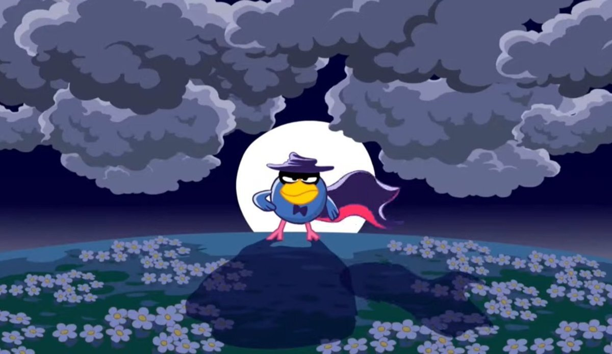

# Смешарики: Кар-Карыч и Совунья

*Фан-страница, посвященная легендарным героям Ромашковой долины*

***

## О проекте

Данный проект — это **интерактивный сайт-визитка**, посвященный двум самым мудрым и возрастным персонажам вселенной «Смешариков»: ворону **Кар-Карычу** и сове **Совунье**.

> *«Очень трудно жить, думая о каждой ошибке, которую ты совершил, поэтому всё плохое забываешь, а помнишь только хорошее — очень удобно, <u>но от себя не уйдёшь</u>».*  
> — **Кар-Карыч**

### Небольшое описание персонажей

- **Главные герои**
  - Кар-Карыч
    - Пожилой ворон
    - Путешественник и артист
    - Владеет иностранными языками
  - Совунья
    - Пожилая сова
    - Врач и спортсменка
    - Из древнего рода Хранителей
- **Второстепенные герои**
  - Биби (робот)
  - Панди (ежиха)
  - и др.

***

## Функциональные разделы

На сайте представлены следующие страницы и блоки:

1. **Биография**: История жизни и прошлое персонажа.
2. **Интересные факты**: Уникальные детали, которые знают не все фанаты.
3. **Цитаты**: Культовые фразы из мультсериала.
4. **Фотоальбом**: Галерея с кадрами и артами.
5. **Серии**: Встроенные видео самых запоминающихся эпизодов (через `<dialog>`).
6. **Ромашковая долина**: Интерактивная карта-меню для навигации между персонажами.

***

## Технологии и стек

Для создания сайта использовались следующие технологии и библиотеки:

| Категория | Инструменты |
| :--- | :--- |
| **Языки** | HTML5, CSS3 |
| **Иконки** | Font Awesome 6 / 4 |
| **Шрифты и стили** | Кастомный CSS (Flexbox, Grid, Dialog) |
| **Медиа** | VK Video API (для встраивания серий) |

### Пример диалогового окна, для просмотра видео

Вот так выглядит карточка с видео, реализованная через тег `<dialog>`:

```html
<dialog id="1demoDialog">
    <iframe src="https://vk.com/video_ext.php?oid=-21665793&id=456240960" 
            width="640" height="360" frameborder="0" allowfullscreen>
    </iframe>
    <button onclick="document.getElementById('1demoDialog').close()">
        <i class="fa-solid fa-x"></i>
    </button>
</dialog>
```
## Структура проекта
<span style="text-decoration: underline;">project-root</span>:
- index.html ~~Главная страница — профиль Кар-Карыча~~
- index2.html ~~Вторая страница — профиль Совуньи~~
- индекс (6).html 
- code.css 
- code2.css 
- стиль.css ~~Основной файл стилей~~
- 1.jpg ~~Изображение для фотоальбома~~
- car1.webp ~~Иконка сайта~~
- sova.gif ~~Иконка для страницы Совуньи~~
- carta.jpg ~~Карта Ромашковой долины~~
- карта2.png ~~# Карта Ромашковой долины~~
- фон.mp3 ~~Фоновая музыка для страницы Кар-Карыча~~
- fonsov.mp3 ~~Фоновая музыка для страницы Совуньи~~

***

## Что есть на страничке моего сайта

- [x] Header с навигацией
- [x] Кастомный аудиоплеер с кнопками play/pause
- [x] Галлерея изображений на Flexbox
- [ ] Реализовать адаптивную верстку для мобильных
- [x] Добавить темную тему оформления
- [ ] Оптимизировать загрузку изображений

***
## Изображения  на сайте

### Кар-карыч:


### Совунья:


### Ромашковая долина:


### Пример картинки из галлереи:



***

### Ссылка проекта:
 - [Официальный сайт смешариков](https://www.smeshariki.ru/ "Перейти на официальный сайт Смешариков")
 - [Ссылка на проект](https://github.com/rerazin-off/FirstWeb "Перейти на сайт проекта")
 - [Ссылка на разработчика](https://github.com/rerazin-off "Перейти на профиль разработчика")

